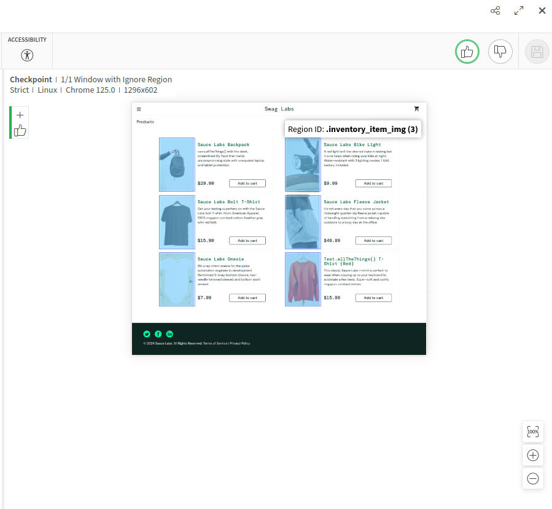

# Visual Test Automation with Python and Applitools

## Overview
This project aims to create an automated solution for visual testing by integrating Python with Applitools Eyes. The main functionality is to enable automated visual comparisons on web pages, with the capability to ignore specific areas of the page, such as headers and footers, which may contain dynamic elements that are not relevant for visual validation.

## Objectives
- **🔍 Visual Test Automation**: Implement an automated visual testing solution using Python and Applitools Eyes.
- **🚫 Ignore Regions Configuration**: Allow defining specific regions of the page to be ignored during visual comparison using CSS selectors.
- **🔧 Ease of Integration**: Ensure the solution is easy to integrate into CI/CD pipelines, providing immediate visual feedback on UI changes.

## Key Features
- **🖥️ Test Sessions with Applitools Eyes**: Initialization and closing of visual test sessions with Applitools Eyes, including API key configuration.
- **📸 Visual Capture and Comparison**: Capture screenshots of web pages and compare them with a previously defined visual baseline.
- **✂️ Defining Ignore Regions**: Use CSS selectors to define page regions to be ignored during visual comparison, such as elements with specific classes (.header, .footer).
- **🤖 Automation with Python**: Utilize Python to orchestrate the test flow, including opening browsers, navigating pages, and executing visual checkpoints.

## Technologies Used
- **🛠️ Python**: Programming language used to create and manage test cases.
- **🌐 Selenium**: Tool for browser automation.
- **👁️ Applitools Eyes**: Visual testing tool that offers AI and machine learning-based visual comparisons.

## Installation

1. **Clone the repository and navigate to the project directory**:
    ```bash
    git clone <repository-url> visual-test-automation
    cd visual-test-automation
    ```

2. **Create a virtual environment and install the dependencies**:
    - **Windows**:
        ```bash
        python -m venv venv
        .\venv\Scripts\activate
        pip install -r config/requirements.txt
        ```
    - **Linux/Mac**:
        ```bash
        python3 -m venv venv
        source venv/bin/activate
        pip install -r config/requirements.txt
        ```

## Running the Tests

1. **Activate the virtual environment** (if not already activated):
    - **Windows**:
        ```bash
        .\venv\Scripts\activate
        ```
    - **Linux/Mac**:
        ```bash
        source venv/bin/activate
        ```

2. **Execute the visual test**:
    ```bash
    pytest tests/test_login.py
    ```

## Test Results

The test results, including screenshots captured during the visual tests, can be found in the `images` directory. Below is an example of a screenshot with the ignored region highlighted:

<p align="center">
  
</p>

<p align="center">
  
</p>

*Description: The area with the `.inventory_item_img` class was ignored by Applitools. The element returned multiple elements with the same selector, which caused the images to be ignored in the visual diff.*


## References

<p align="left">

[Applitools Documentation](https://applitools.com/docs/api-ref/sdk-api/xcui/checksettings/)

[pytest Documentation](https://docs.pytest.org/en/stable/)

</p>

## Directory Structure

```plaintext
visual_test_automation_python_applitools/
│
├── venv/
├── config/
│   ├── applitools_config.yaml
│   └── requirements.txt
├── data/
│   └── data.json
├── images/
│   └── screenshot.png
├── libraries/
│   ├── EyesLibrary.py
│   └── BrowserManager.py
├── pages/
│   ├── __init__.py
│   ├── base/
│   │   └── base_page.py
│   ├── login_page.py
│   ├── inventory_page.py
│   └── selectors.py
├── tests/
│   └── test_login.py
├── .gitignore
├── README.md
